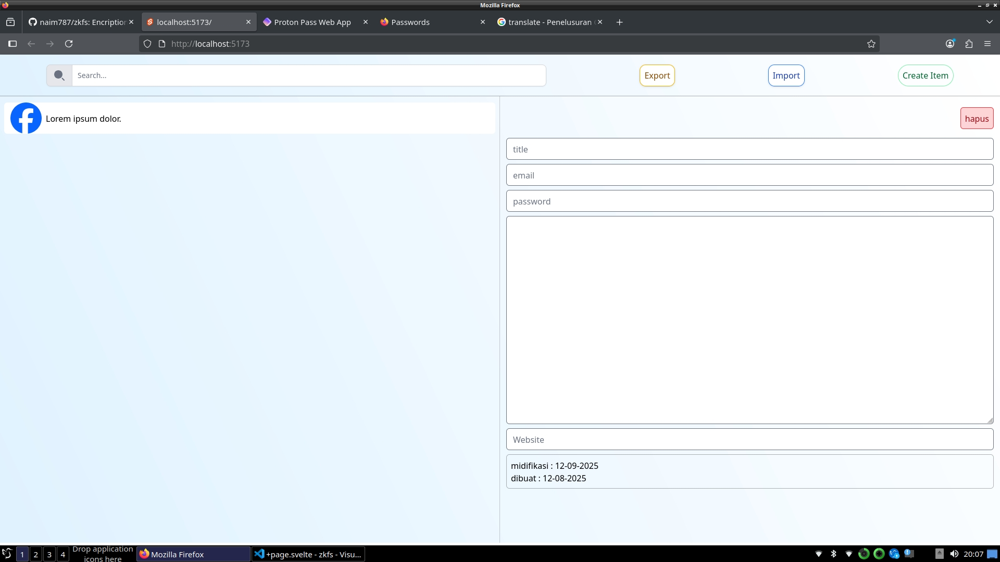

## bash
```sh
# cloning
git clone  https://github.com/naim787/zkfs.git

# install dependensi
bun install

# install dependensi
bun run dev
```
ZKFS can handle your password backup problems more securely than you think. ZKFS is an application that can encrypt your email password data and identity data more securely. And don't forget to export your data!!!

